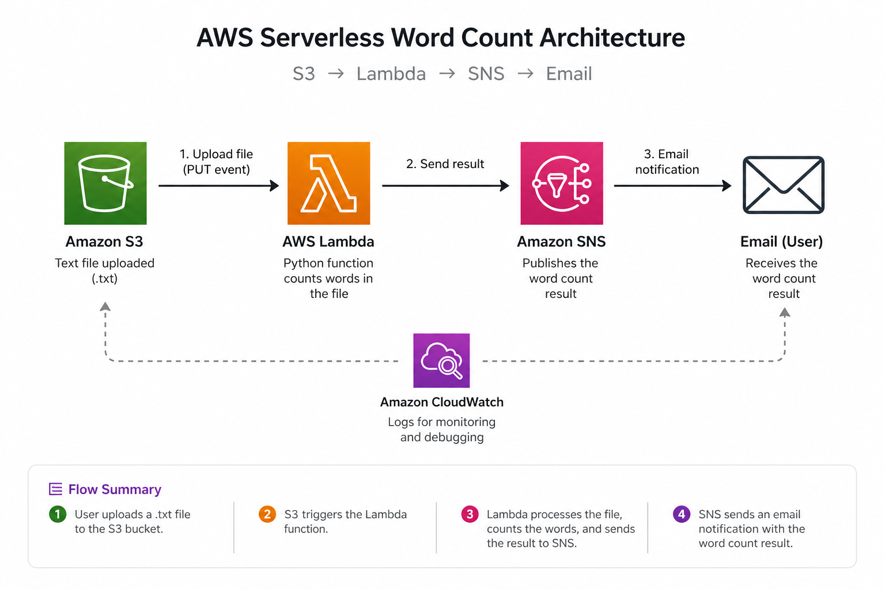
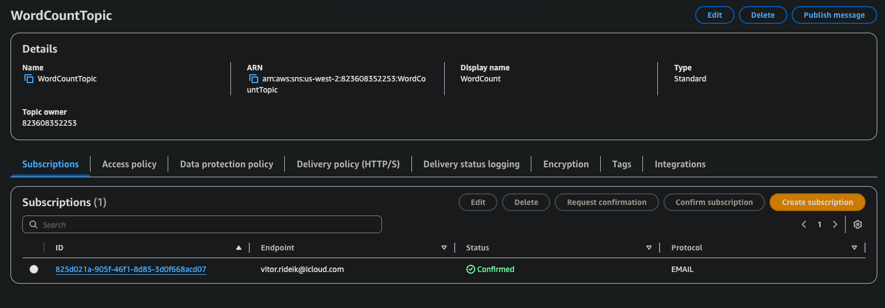
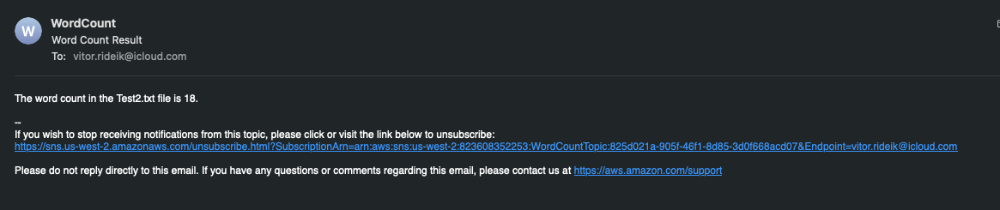

# AWS Serverless Word Count

## Overview
This project uses AWS Lambda to process text files uploaded to an S3 bucket and count the number of words.

## Architecture
- S3 bucket (file upload trigger)
- Lambda function (Python)
- SNS (email notification)

## How it works
1. A .txt file is uploaded to S3
2. S3 triggers the Lambda function
3. Lambda reads the file and counts the words
4. The result is sent via SNS email

## Technologies
- AWS Lambda
- Amazon S3
- Amazon SNS
- Python (boto3)

## What I learned
- Event-driven architecture in AWS
- How to trigger Lambda from S3
- Debugging issues with environment variables
- Handling permissions (IAM roles)

## Future improvements
- Add Terraform to automate deployment
- Store results in DynamoDB

## 📸 Screenshots

### Architecture

### Lambda Configuration

### S3 Trigger

### SNS Setup

### Result
